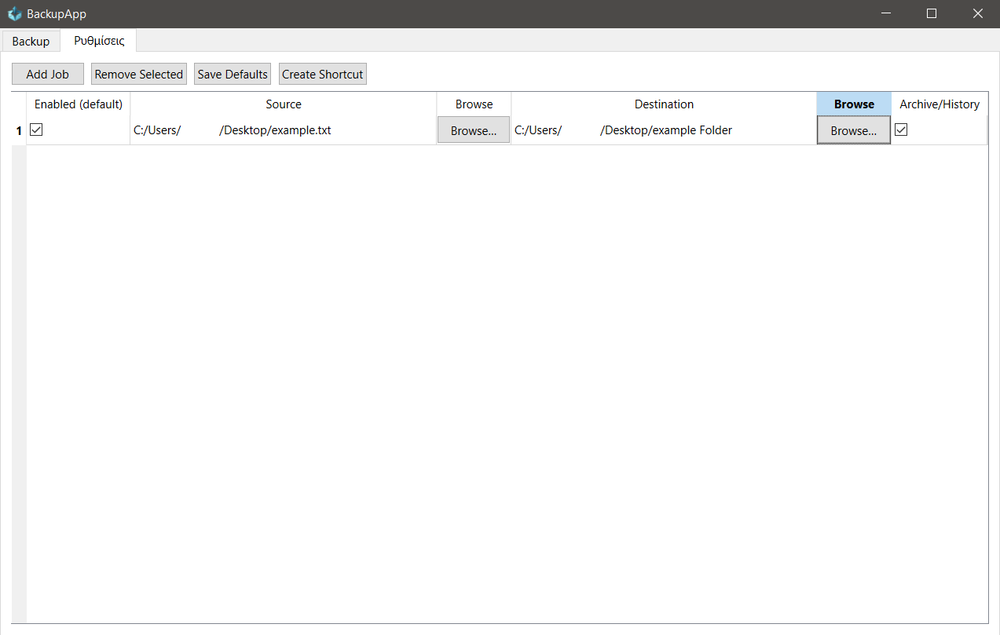
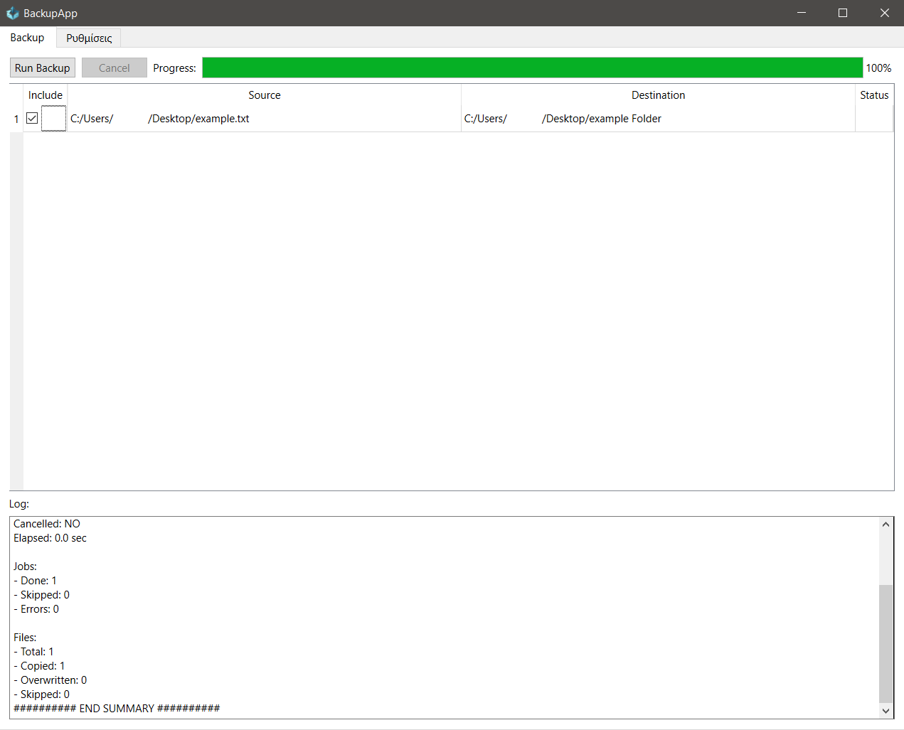
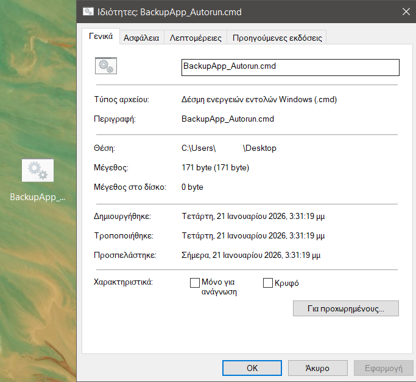
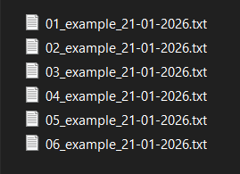

# BackApp

BackApp is a portable Windows GUI app for creating quick, reliable backups of selected folders to a target location.

**Highlights**
- Backup profiles (save default settings and reuse anytime)
- One-click backup with progress + logs
- Optional scheduled runs / autorun support (Windows Task Scheduler)

**Download**
- Get the latest build from **Releases**: https://github.com/Spikesix/BackApp/releases

## Run (onedir package)

1. Download BackApp-v1.0.0-win64.zip from the Releases.
2. Extract the ZIP.
3. Run `BackApp.exe`.

**Keep these together in the same folder:**

- `BackApp.exe`
- `app.ico` (loaded by the app at runtime)
- `internal/` (or `_internal/`) (runtime files)

## How the app works (the flow)

### A) Settings tab (create & save your default jobs)

1. Click **Add Job**.

2. A new empty row appears. For each job you must set:

   **a) Enabled (default)**
   
   - Checkbox.
   - If checked, this job becomes part of your saved defaults and will run in Autorun.

   **b) Source**
   
   - Where the backup comes from.
   - Click **Browse… (Source)**.
   - Choose **File** (single file) or **Folder** (entire folder).
   - The selected path is written into the Source cell.

   **c) Destination**
   
   - Where the backup will be stored (must be a folder).
   - Click **Browse… (Destination)**.
   - Select the target folder.

   **d) Archive / History**
   
   - Checkbox.
   - If checked, the app creates versioned copies instead of overwriting.

3. Repeat **Add Job** to create more jobs.

4. Click **Save Defaults** to store all jobs permanently.

**Important:** Any change in the Settings tab is temporary until you press **Save Defaults**.

### B) Backup tab (run backups for this session)

1. Use **Include** (checkbox) to choose which saved jobs run **right now**.
   - This does **not** change your saved defaults.
2. Click **Run Backup**.
3. Watch:
   - **Progress** bar (overall)
   - **Status** column (per job)
   - **Log** panel (detailed messages)
4. Click **Cancel** to request stop.

## Button reference (what each button does)

### Settings tab

- **Add Job**
  - Adds a new job row with empty Source/Destination.
- **Remove Selected**
  - Deletes the currently selected job rows.
- **Save Defaults**
  - Saves the current Settings table into `backup_config.json`.
  - Resets the Backup tab’s session selection to match your saved defaults.
- **Create Shortcut**
  - Creates a `.cmd` (or `.bat`) file that runs the app with `--autorun`.
  - The shortcut sets the correct working folder before launching.

### Backup tab

- **Run Backup**
  - Runs the jobs that have **Include = checked** and have valid Source + Destination.
- **Cancel**
  - Requests cancellation of the running backup process.

### Browse… buttons (Settings table)

- **Browse… (Source)**
  - Prompts you to pick **File** or **Folder**, then fills the Source cell.
- **Browse… (Destination)**
  - Prompts you to pick a destination folder, then fills the Destination cell.

## Archive/History (what it does)

When **Archive/History** is enabled for a job:

- Creates versioned backups using a sequence number + date (`dd-mm-yyyy`).
- Keeps a hidden history index in the destination:
  - `Destination\.backup_history\...`

## Autorun mode

Autorun runs a backup **immediately** using your **saved defaults** (jobs that are **Enabled (default)** in the Settings tab). It’s meant for “one-click” runs without opening or reconfiguring anything.

### One‑click shortcut file

In **Settings**, click **Create Shortcut**.

This creates a `.cmd` (or `.bat`) file (for example: `BackupApp_Autorun.cmd`).

How it works:
- You double‑click this file.
- The app starts automatically.
- It runs a full backup using your **saved defaults**.
- No UI interaction is required.

What runs in Autorun:
- Only jobs that are marked **Enabled (default)**.
- Only jobs that were saved using **Save Defaults**.

To change what Autorun does:
1. Open the app.
2. Go to **Settings**.
3. Change the **Enabled (default)** checkboxes.
4. Click **Save Defaults**.

From now on, the shortcut will use the new configuration.
- To change Autorun behavior: edit the jobs in **Settings** → toggle **Enabled (default)** → **Save Defaults**.

## Files the app creates

Next to the EXE:

- `backup_config.json` (saved defaults)
- `logs\...` (hidden log folder)
- `crash.log` / `fatal.log` (only if something goes wrong)

